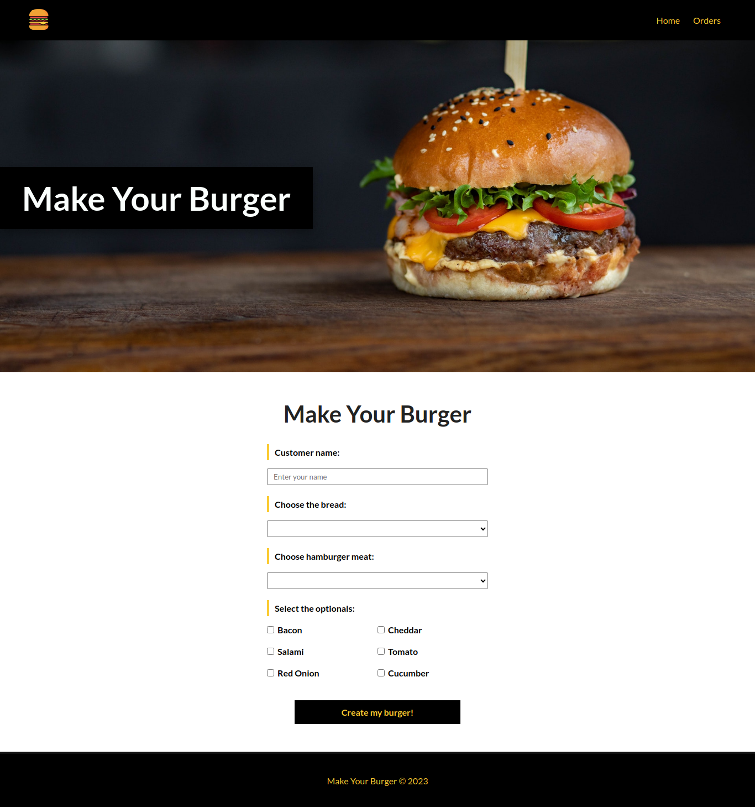

# Make Your Burger

This is a Vue.js application that allows users to make burger orders by making requests to APIs. It utilizes routes to navigate between different pages and interacts with a JSON server to retrieve and store data.

## Project Setup

To set up the project, follow the steps below:

1. Clone the repository:

```
git clone <repository-url>
```

2. Navigate to the project directory:

```
cd make_your_burger
```

3. Install dependencies:

```
npm install
```

## Starting the JSON Server

The JSON server is used to simulate a backend API for this application. To start the JSON server, follow the steps below:

1. Open a new terminal window.

2. Navigate to the project directory (if you're not already in it).

3. Start the JSON server:

```
json-server --watch db.json
```

The JSON server will start running at http://localhost:3000 and serve the data from the db.json file.

## Compiles and hot-reloads for development

To run the application in development mode with hot-reloading, use the following command:

```
npm run serve
```

The application will be compiled and served at http://localhost:8080. Any changes you make to the source code will trigger an automatic reload in the browser.

## Compiles and minifies for production

When you are ready to deploy the application to a production environment, you can use the following command to build a minified version:

```
npm run build
```

The compiled and minified files will be stored in the dist/ directory.



That's it! You have successfully set up the Make Your Burger application. Enjoy making burger orders through the API requests!
